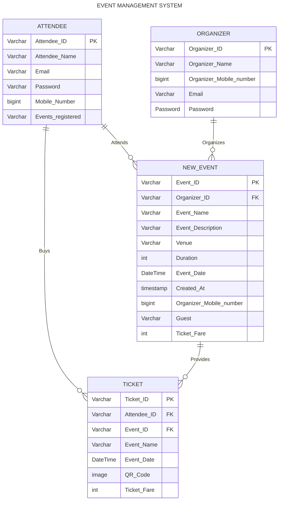
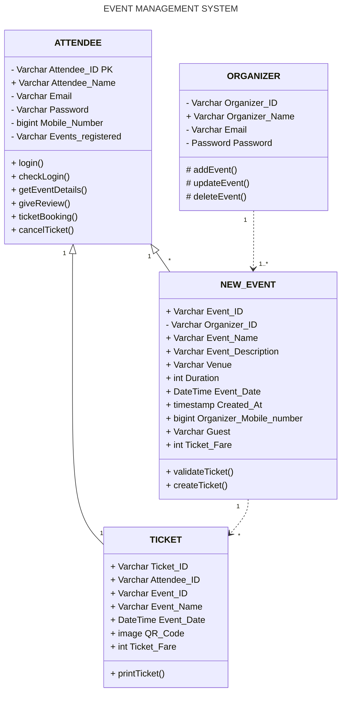

# Event Management System

An application for managing events, including registrations,
schedules, and ticket sales. Event organizers can create, update, and delete
event information.

## User Classes and Characteristics:

The system caters to distinct user roles – Organizers and Attendees. Organizers, as central administrators, wield comprehensive privileges for effective event management. Attendees, participants in events, access a user-friendly interface for seamless registration and participation. This ensures a streamlined and personalized experience for both within the Event Management System.

**The features that are available to the Organizer are :**

- Organizer can create and schedule an event.
- Organizer can update or edit event information.
- Organizers can use the system to scan tickets and facilitate event check-ins.
- Organizers can manage attendee information for effective event coordination

**The features that are available to the Attendees are :**

- Attendees can access event details, schedules, and promotional information.
- Attendees can sign up for events and purchase tickets through the system.
- Attendees can give rating and review for an event

## Operating Environment

The Event Management System is an application will be operating in all operating system like Linux, MacOS.The
only requirement to use this online product would be the internet connection.The hardware configuration include Hard Disk: 40 GB, Monitor: 15” Color monitor, Keyboard:
122 keys. The basic input devices required are keyboard, mouse and output devices are monitor,
printer etc.

## Assumptions and Dependencies :

**The Assumptions are :**

- The coding should be error free
- The information of all attendees, events and events organizer must be stored in a database that is accessible by the website.
- The system should provide search facility and support quick transactions.
- Users may access from any computer that has internet browsing capabilities and an Internet connection.

**The Dependencies are :**

- Any update regarding the event is to be recorded to the database and the data entered should be correct.
- The information of all users must be stored in a database that is accessible by the Event Management System.
- The system should have the general report stored.
- On the basis of listing requirements and specification the project will be developed and run.

## ER Diagram

## Class Diagram

## Database Design :
 

**Attendee Table->**

| Field Name        | Data Type   | Constraint  | Description                                |
|-------------------|-------------|-------------|--------------------------------------------|
| Attendee_ID       | varchar(20) | Primary key | Unique ID for attendee                     |
| Attendee_name     | varchar(20) | Not Null    |                                  user name |
| Email             | varchar(20) | Not Null    | user email for login procedure             |
| Password          | varchar(20) | Not Null    | user password for login procedure          |
| Mobile_Number     | bigint      | Not Null    | mobile number for otp verification         |
| Events_registered | varchar(20) | Not Null    | events register to show the upcoming event |

 

**Organizer Table->**

| Field Name        | Data Type   | Constraint  | Description                                |
|-------------------|-------------|-------------|--------------------------------------------|
| Attendee_ID       | varchar(20) | Primary key | Unique ID for attendee                     |
| Attendee_name     | varchar(20) | Not Null    |                                  user name |
| Email             | varchar(20) | Not Null    | user email for login procedure             |
| Password          | varchar(20) | Not Null    | user password for login procedure          |
| Mobile_Number     | bigint      | Not Null    | mobile number for otp verification         |
| Events_registered | varchar(20) | Not Null    | events register to show the upcoming event |

 

**New Event Table->**

| Field name              | Datatype    | Constraint  | Description                    |
|-------------------------|-------------|-------------|--------------------------------|
| Event_ID                | varchar(20) | Primary key | unique id for event            |
| Organizer_ID            | varchar(20) | Foreign key | organizer id from organizer    |
| Event name              | varchar(20) | Not Null    | Event name                     |
| Event_Description       | varchar(20) | Not Null    | Brief Description about event  |
| Venue                   | varchar(20) | Not Null    | Venue of the event             |
| Duration                | int         | Not Null    | Duration of the event          |
| Event_Date              | DateTime    | Not Null    | Date of the event              |
| Created_At              | Timestamp   | Not Null    | When the event is created      |
| Organizer_Mobile_Number | bigint      | foreign key | Mobile number of the organizer |
| Guest                   | varchar     | Not Null    | Guest Description of the event |
| Ticket_Fare             | int         | Not Null    | Fare price of the event        |

 

**Ticket Table->**
| Field name              | Datatype    | Constraint  | Description                    |
|-------------------------|-------------|-------------|--------------------------------|
| Event_ID                | varchar(20) | Primary key | unique id for event            |
| Organizer_ID            | varchar(20) | Foreign key | organizer id from organizer    |
| Event name              | varchar(20) | Not Null    | Event name                     |
| Event_Description       | varchar(20) | Not Null    | Brief Description about event  |
| Venue                   | varchar(20) | Not Null    | Venue of the event             |
| Duration                | int         | Not Null    | Duration of the event          |
| Event_Date              | DateTime    | Not Null    | Date of the event              |
| Created_At              | Timestamp   | Not Null    | When the event is created      |
| Organizer_Mobile_Number | bigint      | foreign key | Mobile number of the organizer |
| Guest                   | varchar     | Not Null    | Guest Description of the event |
| Ticket_Fare             | int         | Not Null    | Fare price of the event        |

